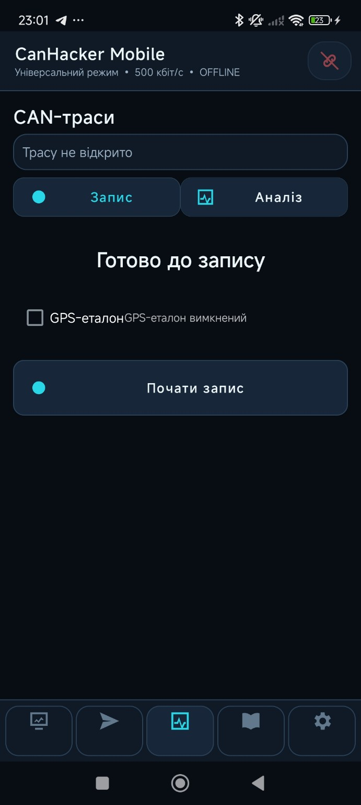
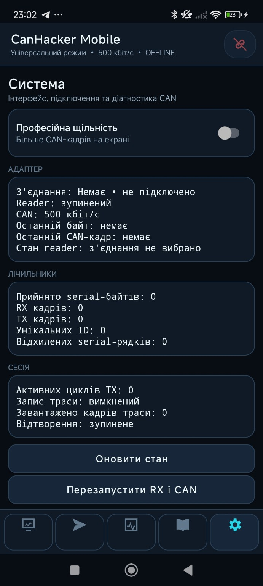

# CAN Hacker

**CAN Hacker** is an open-source project for working with automotive CAN bus systems using a dedicated Android application and custom hardware.

The project is currently under active development.

## Current Status

The first public Android version is available as an **Alpha release**.

Expect bugs, crashes, connection issues, and UI/UX changes while development continues.

## Features

- CAN Monitor
- CAN frame transmission
- Multiple CAN ID support
- CAN ID library
- CAN trace recording
- CAN trace playback
- Bluetooth connectivity
- USB connectivity
- Android interface for real-time CAN work

  ## 📱 Android App Screenshots

  
  
  
  
  

  <b>Monitor</b> •
  <b>Transmitter</b> •
  <b>Trace</b> •
  <b>CAN Library</b> •
  <b>System</b>

## Download

Latest public Alpha:

**CAN Hacker Android v0.1.0 Alpha**

https://github.com/siritamaz98-cmyk/CAN-Hacker/releases/tag/v0.1.0-alpha

## ☕ Support the Project

If you find this project useful and would like to support its development, you can support me on Ko-fi.

Your support helps fund prototype PCBs, electronic components, testing hardware, and continued development of the Android app.

## Feedback

Community feedback is one of the main reasons this project is being published at an early stage.

If you test CAN Hacker, I would really like to hear:

- what works well;
- what feels inconvenient or confusing;
- what bugs or crashes you find;
- what you would change in the interface;
- which features are missing;
- how the application behaves with real CAN hardware.

Constructive criticism is very welcome.

You can use **GitHub Issues** for bugs and feature requests, or join the discussion here:

https://github.com/siritamaz98-cmyk/CAN-Hacker/discussions

## Hardware

Dedicated CAN Hacker hardware is also under development.

The current direction is based on:

- ESP32
- automotive CAN transceiver
- Bluetooth connectivity
- USB connectivity
- protected automotive power input
- switchable CAN termination
- dedicated Android integration

The first hardware revisions will be tested before a more compact production-oriented version is released.

## Roadmap

Planned development includes:

- improved CAN Monitor
- improved Transmitter
- better Trace workflow
- expanded CAN ID library
- vehicle selection by manufacturer and model
- easier creation of custom CAN IDs
- improved Bluetooth and USB connection workflow
- dedicated ESP32 hardware
- improved stability and UI/UX
- community-driven CAN data collection

## Contributing

Testing, bug reports, feature suggestions, UI/UX feedback, and CAN research contributions are welcome.

The project is still young, so community feedback can directly influence future development.

## ⚠️ Safety Warning

**CAN Hacker is experimental software. Use it at your own risk.**

The application can interact with automotive CAN bus systems, including transmitting CAN frames.

Do not transmit CAN frames to a vehicle unless you understand their function and possible consequences.

The developer is not responsible for damage, data loss, vehicle malfunction, or unintended vehicle behavior resulting from the use of this software.

For initial testing, using a bench setup or dedicated test hardware is strongly recommended before connecting the application to a real vehicle.

---

**CAN Hacker — Work in Progress**
