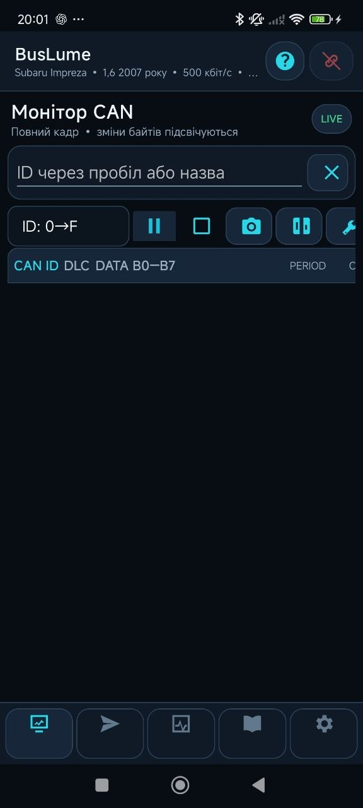
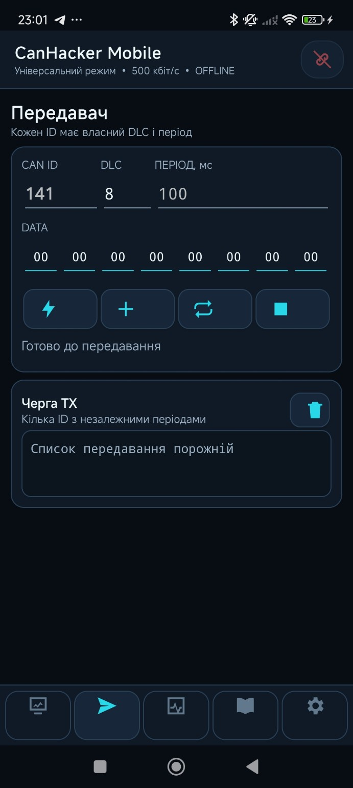
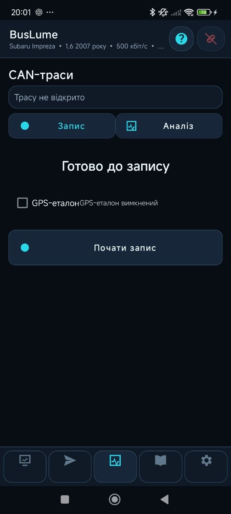
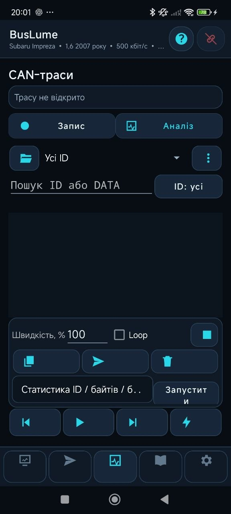
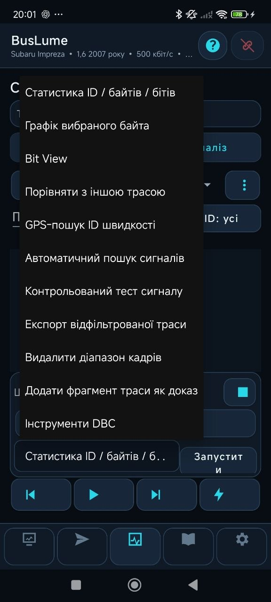
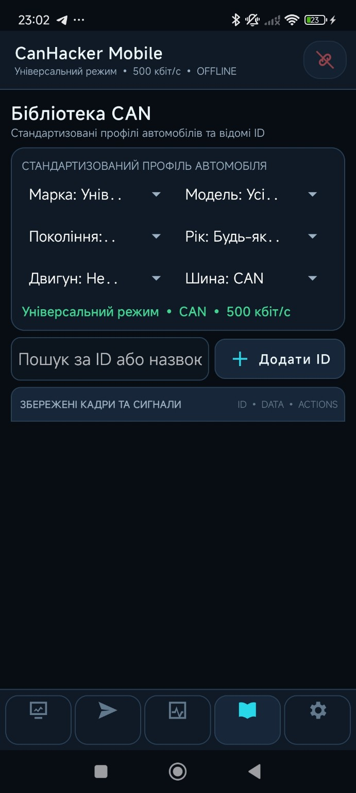

# BusLume

**BusLume** is an open-source Android application for monitoring, transmitting, recording and analyzing automotive CAN bus traffic.

The project is focused on practical CAN research: finding vehicle signals, checking hypotheses against recorded traces, working with DBC data, and building a community-driven library of verified CAN signals.

> 🚧 BusLume is under active development and real-world testing.

## What BusLume can do

- Real-time CAN monitoring
- CAN frame transmission with configurable ID, DLC, DATA and period
- Multiple CAN ID filtering and search
- CAN trace recording and playback
- Trace filtering and comparison
- ID / byte / bit statistics
- Selected-byte graphs and Bit View
- GPS-assisted vehicle-speed signal search
- Automatic signal candidate search
- Controlled signal testing
- DBC tools
- Local CAN signal library
- Shared community CAN library
- Verification trace fragments for saved signals
- Bluetooth and USB connectivity
- Ukrainian and English interface

## Screenshots

### CAN Monitor
Real-time CAN traffic monitoring with ID filtering, full frame data and tools for working with captured frames.

### Transmitter
Create and transmit CAN frames with configurable ID, DLC, data bytes and transmission period. Multiple frames can be prepared for independent transmission.

### CAN Trace Recording
Record CAN traffic for later playback and analysis. GPS can be used as a reference while researching vehicle-speed signals.

### Trace Analysis
Open recorded traces, filter CAN IDs and DATA, play frames back, select ranges and launch analysis tools.

### Analysis Tools
BusLume includes tools for ID/byte/bit statistics, byte graphs, Bit View, trace comparison, GPS speed-ID search, automatic signal search, controlled testing, filtered trace export and DBC work.

### CAN Library
Save discovered signals locally and work with the shared CAN library. Vehicle profiles help organize known IDs and verification data.

## Community CAN Library

One of BusLume's main goals is to make CAN research reusable. A discovered signal can be associated with a vehicle and saved together with supporting information. Verification trace fragments can be attached as evidence so that signals can be checked instead of being treated as unexplained raw IDs.

## Hardware

Dedicated **BusLume hardware** is also under development. The current direction is an ESP32-based automotive CAN interface with USB and wireless connectivity, protected automotive power input and switchable CAN termination.

BusLume can also be developed and tested with compatible CAN interfaces during the project's hardware development phase.

## Project status

BusLume is currently in active development. Interfaces, analysis tools and data structures may change as testing continues.

Public BusLume releases use their own release numbering independently from internal development, beta and fix builds.

## Feedback and contributions

Real-world testing is especially useful. Bug reports, feature suggestions, CAN research, verified signals, trace examples, hardware testing and UI/UX feedback are welcome.

Use **GitHub Issues** for reproducible bugs and feature requests, and **GitHub Discussions** for questions, ideas and CAN research.

## Safety

> **BusLume is experimental software. Use it at your own risk.**

Automotive CAN networks may control safety-critical vehicle systems. Transmitting incorrect CAN frames can cause unexpected vehicle behavior, faults or damage. Do not transmit frames to a vehicle unless you understand their function and possible consequences.

For initial experiments, a bench setup or dedicated test hardware is strongly recommended.

---

**BusLume — illuminate the CAN bus.**
