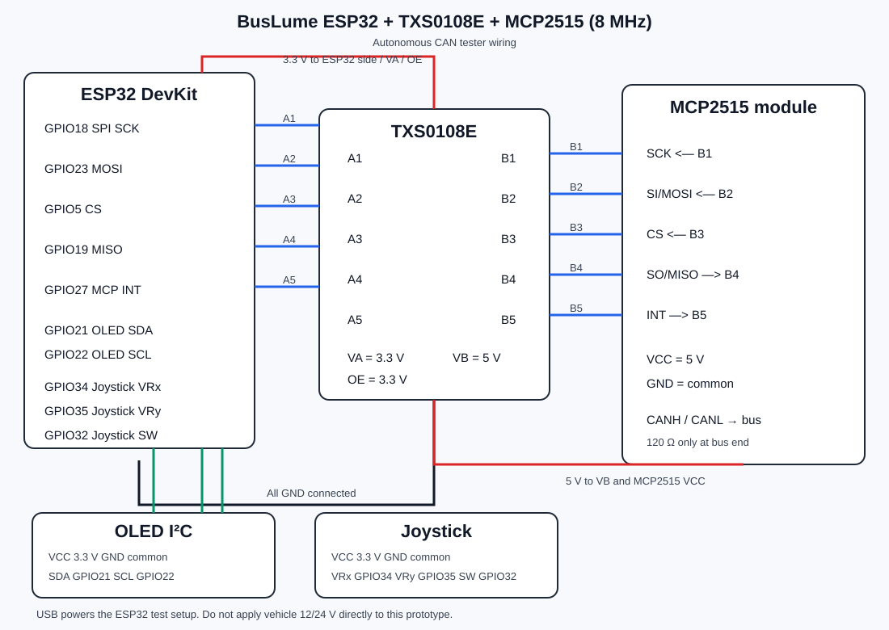

# BusLume ESP32 + MCP2515

Autonomous BusLume CAN tester based on an ESP32 DevKit, an MCP2515 module with an **8 MHz crystal**, a TXS0108E level shifter, an I²C OLED and an analog joystick.

## Main files

- [Complete ESP32 firmware](./BusLume_ESP32_MCP2515.ino)
- [Wiring diagram](./BusLume_ESP32_MCP2515_wiring.svg)

## Wiring

### ESP32 ↔ TXS0108E ↔ MCP2515

| ESP32 | TXS0108E A side | TXS0108E B side | MCP2515 |
|---|---|---|---|
| GPIO18 | A1 | B1 | SCK |
| GPIO23 | A2 | B2 | SI / MOSI |
| GPIO5 | A3 | B3 | CS |
| GPIO19 | A4 | B4 | SO / MISO |
| GPIO27 | A5 | B5 | INT |

Power the level shifter with `VA = 3.3 V`, `VB = 5 V` (the MCP2515 module logic supply), `OE = 3.3 V`, and connect every `GND` together. Leave A6–A8 and B6–B8 unconnected.

The MCP2515 module uses `VCC = 5 V` and common `GND`. Connect `CANH` and `CANL` to the CAN bus. The 120 Ω termination must be enabled only when this device is at the end of the bus.

### OLED (I²C)

| OLED | ESP32 |
|---|---|
| VCC | 3.3 V |
| GND | GND |
| SDA | GPIO21 |
| SCL | GPIO22 |

### Joystick

| Joystick | ESP32 |
|---|---|
| VCC | 3.3 V |
| GND | GND |
| VRx | GPIO34 |
| VRy | GPIO35 |
| SW | GPIO32 |

All local buttons are active-low and connect to GND through the ESP32 internal pull-up.

## Controls

- `GPIO25` — BACK.
- `GPIO26` — start/stop `SEND ALL` in the transmitter.
- Joystick short press — `SIGNAL SHOT`.
- Joystick long press — save/delete depending on the screen.
- In the transmitter, X selects a field and Y changes its value. During `SEND ALL`, the cursor is locked to `PERIOD`.
- In the monitor, Y selects the CAN speed. The selected speed is applied immediately and saved across restart.

## CAN speeds

The firmware supports all rates provided by the MCP2515 library for an 8 MHz crystal: 5, 10, 20, 31.25, 33.33, 40, 50, 80, 100, 125, 200, 250, 500 kbit/s and 1 Mbit/s.

## Safety

This is experimental automotive hardware. Incorrect CAN frames can affect vehicle systems. Start on a bench or isolated test network, verify the bitrate and termination, and connect to a vehicle only when the frame function is understood.
